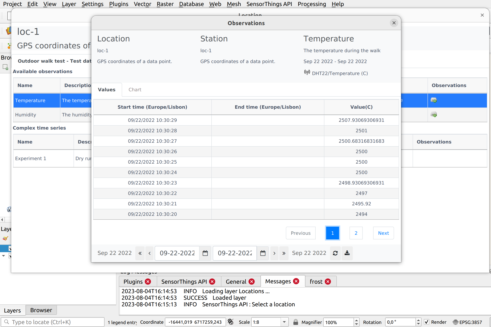

# eMOTIONAL Cities SDI


[](https://zenodo.org/badge/latestdoi/495373503)

This document describes how to setup and run the Spatial Data Infrastructure (SDI) from the [eMOTIONAL Cities project](https://emotionalcities-h2020.eu/). If you are in rush, you can jump to the [next section](#Quick-Setup).

These docker-compositions are loosely based on the compositions from the [pygeoapi project](https://pygeoapi.io/). They enable building and running a stack of FOSS & FOSS4G/[OSGeo](https://www.osgeo.org/) software, which implements an SDI using the latest [OGC API](https://ogcapi.ogc.org/) standards. This infrastructure is mostly focused on **sharing vector data, and its related metadata**.

Regardess of the docker-composition you choose to run, you will launch a system which includes `pygeoapi` using an `Elasticsearch` backend for storing both, data and metadata. 

In addition, we have leveraged other tools from the [ELK](https://www.elastic.co/what-is/elk-stack): `logstash` to transform and insert metadata and `kibana` to visualize the content of the elasticsearch indexes.

## Quick Setup

You will need `docker` and `docker-compose` installed in your system, in order to run this infrastructure. If you don't have them already, you can use the provided convenience script to install them:

```
./install_docker.sh
```

## Start pygeoapi

The simplest way to start the SDI is by using the `docker-compose-pull.yml` composition:

```
docker-compose -f docker-compose-pull.yml up -d
```

This will pull and run all the relevant docker images. If you encounter any issues, please read the [Troubleshooting section](#Troubleshooting). If you have a more advanced use case, please continue reading.

The `docker-compose-pull.yml` composition pulls the images from [docker hub](https://hub.docker.com/orgs/emotionalcities). In some cases, you may need to do some changes which require rebuilding the images (e.g.: you want to use a different dataset). In those cases, you may use `docker-compose-local.yml`:

```
docker-compose -f docker-compose-local.yml build
```

And then:

```
docker-compose -f docker-compose-local.yml up -d
```

After building images locally with ```docker-compose-local.yml```, you can push them to docker hub:

```
docker tag openapi-sdi_elastic_search  emotionalcities/openapi-sdi_elastic_search
docker tag openapi-sdi_metadata_logstash  emotionalcities/openapi-sdi_metadata_logstash
docker tag openapi-sdi_geopackage_pusher   emotionalcities/openapi-sdi_geopackage_pusher
docker tag openapi-sdi_postgis emotionalcities/sdi-template-postgis
docker push emotionalcities/openapi-sdi_elastic_search
docker push emotionalcities/openapi-sdi_metadata_logstash
docker push emotionalcities/openapi-sdi_geopackage_pusher
docker push emotionalcities/sdi-template-postgis
```

The `docker-compose.yml` is designed for production and it includes a web server. Launch it with:

```
docker-compose up -d
```

You can read more about docker-compose on this [link](https://docs.docker.com/compose/gettingstarted/)

Regardless the composition you choosen, when all goes well, pygeoapi will be available at port 80 of the host: http://localhost.

## Environment Variables

This compositions read secrets from an environment file on this folder: ```.env```.

Create this file with the following format, replacing "SOMEPASSWORD" by reasonable values.

```
POSTGRES_PASSWORD="SOMEPASSWORD"
POSTGRES_DB="SOMEPASSWORD"
POSTGRES_USER="SOMEPASSWORD"
FROST_USER="SOMEUSERNAME"
FROST_PASSWORD="SOMEPASSWORD"
```

Elasticsearch ingests Geojson files stored in remote S3 bucket. To access the S3 bucket it's necessary to create a file inside ES directory, named `credentials` with following content:

```
[default]
aws_access_key_id=YOURSECRET_WITHOUTQUOTES
aws_secret_access_key=YOURSECRET_WITHOUTQUOTES
aws_region=eu-central-1
```

`ES/credentials` is loaded in the image, so it must exists during build time. So, every time you change it, please remember to run:

```
docker-compose -f docker-compose-local.yml build
```

With .env file it's not necessary, because it's injected during docker compose `up`.

## Troubleshooting

Elasticsearch requires the host system to have its virtual memory
parameter (**max_map_count**) [here](https://www.elastic.co/guide/en/elasticsearch/reference/current/vm-max-map-count.html)
set as follows:

```
sudo sysctl -w vm.max_map_count=262144
```

If the docker composition fails with the following error:
```
docker_elastic_search_1 exited with code 78
```

it is very likely that you need to setup the `sysctl`.


# SensorThings API Server

This server is the [FROST](https://fraunhoferiosb.github.io/FROST-Server/deployment/docker.html) implementation of the [OGC Sensor Things API Standard](https://docs.ogc.org/is/18-088/18-088.html).

## Quick Setup

You will need `docker` and `docker-compose` installed in your system, in order to run this infrastructure. 

First create a `.env` file with the environment variables. For example (replace the values for sensible values):

```
POSTGRES_PASSWORD="nenwwnew"
POSTGRES_DB="ddmdwlmwe"
POSTGRES_USER="dmwledmw"
STA_USER="dqkmqdwlmwwmwl"
STA_PASSWORD=dddddddddddd
FROST_USER=dd
FROST_PASSWORD=edl,el,eed
```

Change script permission:

```
sudo chmod +x sensorthings.sh
```

Then run:

```
docker-compose up -d
```

Access the server on:
http://localhost/FROST-Server/

## Add Data

The frost endpoint is protected with basic authentication. Replace `user` with your user, defined in the .env file with `FROST_USER` and `mypassword` with the defined  `FROST_PASSWORD`.

We recommend using a client like the [frost-sta-client](https://pypi.org/project/frost-sta-client/)

## Consume Data

You can view/analyse data using any sensorthings API compliant client, for instance the [SensorThingsAPI QGIS plugin](https://github.com/AirBreak-UIA/SensorThingsAPI_QGIS-plugin) (see screenshots bellow).


 

## License

This project is released under an [MIT License](./LICENSE)

[](https://opensource.org/licenses/MIT)
